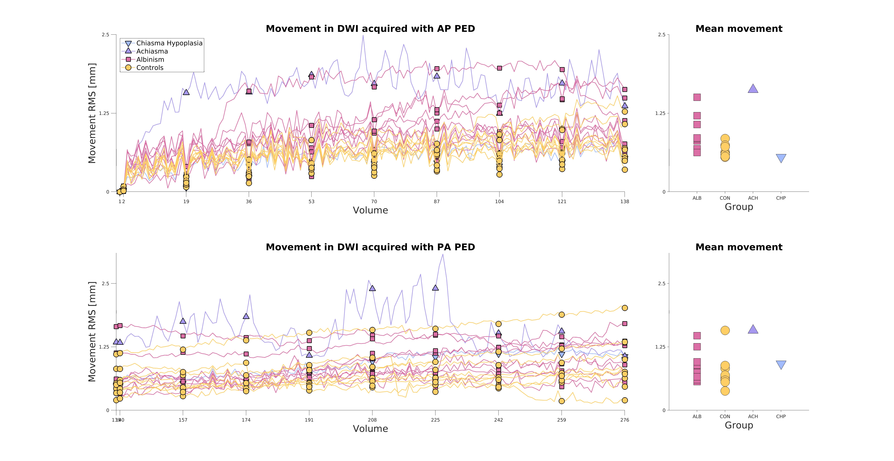

### Figure 5. Participants' motion during DW scan. 
Total movement, expressed as a root mean square (RMS) of sum of squared displacements and calculated with respect to the first acquired volume. The top row corresponds to the first series of DW acquisition, with Anterior -> Posterior Phase Encoding Direction (AP PED), the bottom one to second series with Posterior -> Anterior (PA) PED. The left column displays movement for each participants across all volumes, with the b0 volumes marked by x-axis ticks. The right column displays mean movement in given series.

## Reproducing the results
The motion estimation was performed using `eddy` command from FSL software, which outputs this information in the `eddy_movement_rms` files. Those files are provided in the `Data` folder, together with a sample file with information about b-values (in order to mark b0 volumes). The above displayed image can be generated by running the provided MATLAB script `plot_motion.m`. 

